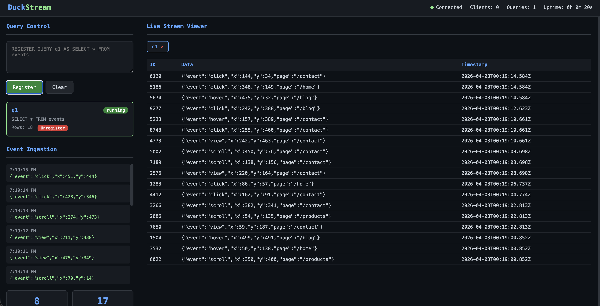

# duckstream

SQL queries registered in DuckDB become long-running streaming queries, with results continuously streamed over QUIC until explicitly stopped.

## Architecture

```
Data → Ingestion → DuckDB → Query Runtime → QUIC → Client
```

- **Ingestion Layer**: HTTP POST endpoint receives JSON data, batch inserts into DuckDB `events` table using DuckDB Appender API
- **Query Runtime**: Manages persistent streaming queries with incremental polling
- **QUIC Transport**: Streams results to connected clients via QUIC
- **Control Surface**: REPL + HTTP API + Web Dashboard for registering/unregistering queries

## Quick Start

```bash
# Terminal 1: Start the server
go run ./cmd/main.go

# In the server REPL, register a query:
> REGISTER QUERY q1 AS SELECT * FROM events

# Terminal 2: Run the demo client
go run ./cmd/demo

# Terminal 3: Open the dashboard
# Open frontend/index.html in a browser
```

The server starts:
- QUIC server on `localhost:4242`
- HTTP API on `localhost:8080`
- REPL control surface (stdin)

## HTTP API

```bash
# List queries
curl http://localhost:8080/queries

# Register query
curl -X POST http://localhost:8080/queries \
  -H "Content-Type: application/json" \
  -d '{"id":"q1","sql":"SELECT * FROM events"}'

# Unregister query
curl -X DELETE http://localhost:8080/queries/q1

# Get metrics
curl http://localhost:8080/metrics
```

## Features

### Query Validation
Invalid SQL is rejected before creating an executor:
```bash
curl -X POST http://localhost:8080/queries \
  -H "Content-Type: application/json" \
  -d '{"id":"bad","sql":"SELECT * FROM nonexistent"}'
# Returns: invalid query: table does not exist
```

### Metrics Endpoint
Tracks:
- `queries_registered` - total queries registered
- `queries_unregistered` - total queries unregistered  
- `rows_sent` - total rows streamed
- `errors` - total errors
- `active_clients` - current QUIC connections
- `active_queries` - current running queries

### Connection Limits (Sane Defaults)
- Max clients: 100
- Max streams per client: 10
- Max queries: 50

### Query-Specific Streams
Each query gets its own QUIC stream - different queries don't share streams.

## Dashboard

Open `frontend/index.html` in a browser for a live dashboard with:
- Query Control Panel - register/unregister queries
- Live Stream Viewer - real-time results for each query
- Event Ingestion Panel - live feed of events
- System Status Bar - connection status, uptime, metrics



## How It Works

**The Core Concept:** Think of `events` as an infinite append-only log. Each registered query is like subscribing to a filtered view of that log. New events are continuously delivered to all active subscribers.

**Step by Step:**

1. **Data flows in**: Events are inserted into the `events` table via HTTP POST. Each event gets a unique auto-incrementing `id`.

2. **Queries run continuously**: When you register a query like `SELECT * FROM events WHERE data->>'event' = 'click'`, the system creates a long-running executor that:
   - Remembers the last `id` it has seen
   - Polls DuckDB every 100ms for "new rows where id > lastSeen"
   - Sends any matching rows over QUIC to connected clients

3. **Independent subscriptions**: Each query tracks its own position. You can register 10 different queries with different filters - they'll all run independently, each getting only the rows that match their filter.

4. **Streaming over QUIC**: Results flow over QUIC streams. Each query maps to a stream. Clients connect to the QUIC server and read from their stream to get continuous updates.

5. **Explicit lifecycle**: Queries run forever (or until server stops). Use `UNREGISTER QUERY id` to stop a specific query and free its resources.

**Analogy:**
```
events table     = a journal/log
query            = a subscription to that journal with a filter
executor         = a background worker that checks for new entries
QUIC stream      = a delivery channel to the subscriber
```

## Configuration

Default configuration in `internal/config/config.go`:
- `DuckDBPath`: `"duckstream.db"`
- `QUICAddr`: `"localhost:4242"`
- `IngestAddr`: `"localhost:8080"`
- `BatchSize`: `100` - Events per batch
- `BatchTimeout`: `1s`
- `PollInterval`: `100ms`
- `MaxClients`: `100`
- `MaxStreamsPerClient`: `10`
- `MaxQueries`: `50`

## REPL Commands

- `REGISTER QUERY <id> AS <sql>` - Start streaming a query
- `UNREGISTER QUERY <id>` - Stop streaming and remove query
- `LIST QUERIES` - Show active queries
- `HELP` - Show help
- `QUIT` - Exit

## Behavior

- Tables are append-only signals (events)
- Queries are persistent transformations over those signals
- Execution is a live cursor that never naturally terminates
- QUIC delivers output streams to clients
- Queries run continuously until explicitly unregistered

## Limitations

### Current Architecture Trade-offs

1. **Polling-Based, Not Change Data Capture**
   - The system uses incremental polling (`WHERE id > lastID`) every 100ms
   - This is not real-time streaming like CDC (Change Data Capture)
   - There is inherent latency between when a row is inserted and when it's delivered

2. **Requires `id` Column for Incremental Streaming**
   - For tables with an `id` column (auto-incrementing), the system tracks position and delivers only new rows
   - For tables without `id` or with non-sequential IDs, **all rows are re-sent on every poll**
   - This works: `SELECT * FROM events WHERE id > 0` (incremental)
   - This re-sends everything: `SELECT * FROM orders WHERE created_at > '...'` (full poll each time)

3. **Aggregation Queries Re-compute Entire Result**
   - Queries like `SELECT sum(sale_amt) FROM sales` will re-run completely each poll
   - The entire aggregation is re-sent, not just the delta
   - For high-frequency inserts, this means sending the same aggregate repeatedly

4. **No Native Support for Arbitrary SQL Streaming**
   - Not all SQL queries can be efficiently streamed
   - Complex JOINs, window functions, and subqueries may not behave as expected
   - The system is optimized for simple filtered views of append-only tables

### What Works Well

- `SELECT * FROM table WHERE id > N` - incremental row delivery
- `SELECT * FROM events WHERE data->>'type' = 'click'` - filtered incremental
- Any query on tables with auto-incrementing `id` column

### What Doesn't Work Well (Or At All)

- `SELECT sum(amount) FROM sales` - re-sends entire aggregate each poll
- `SELECT * FROM table WHERE timestamp > X` - no timestamp tracking, full re-send
- Complex queries without stable `id` column for position tracking