# DuckStream Architecture

## System Overview

DuckStream is a real-time streaming SQL engine built on DuckDB. It transforms SQL queries registered against an append-only events table into continuously running streams delivered over QUIC.

## High-Level Architecture

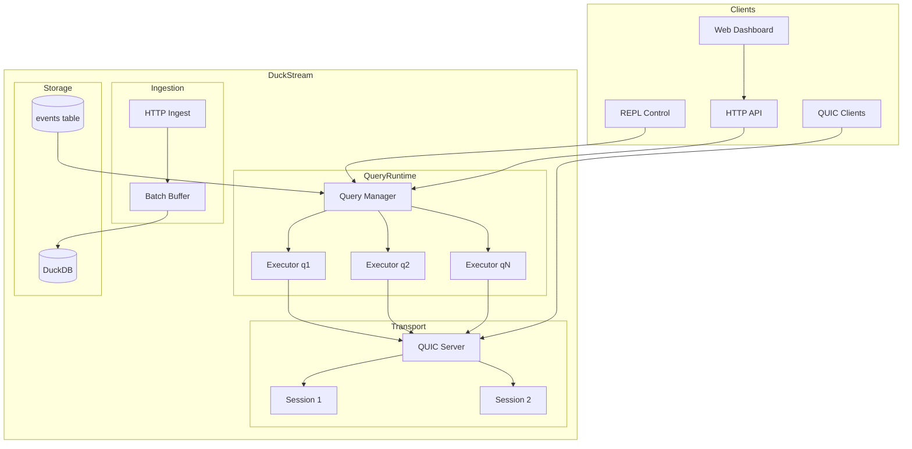

## Component Interactions

### Data Flow

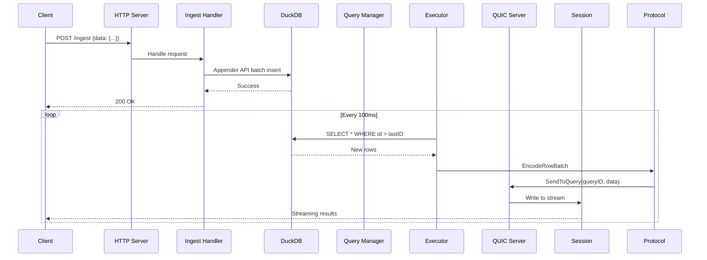

### Query Lifecycle

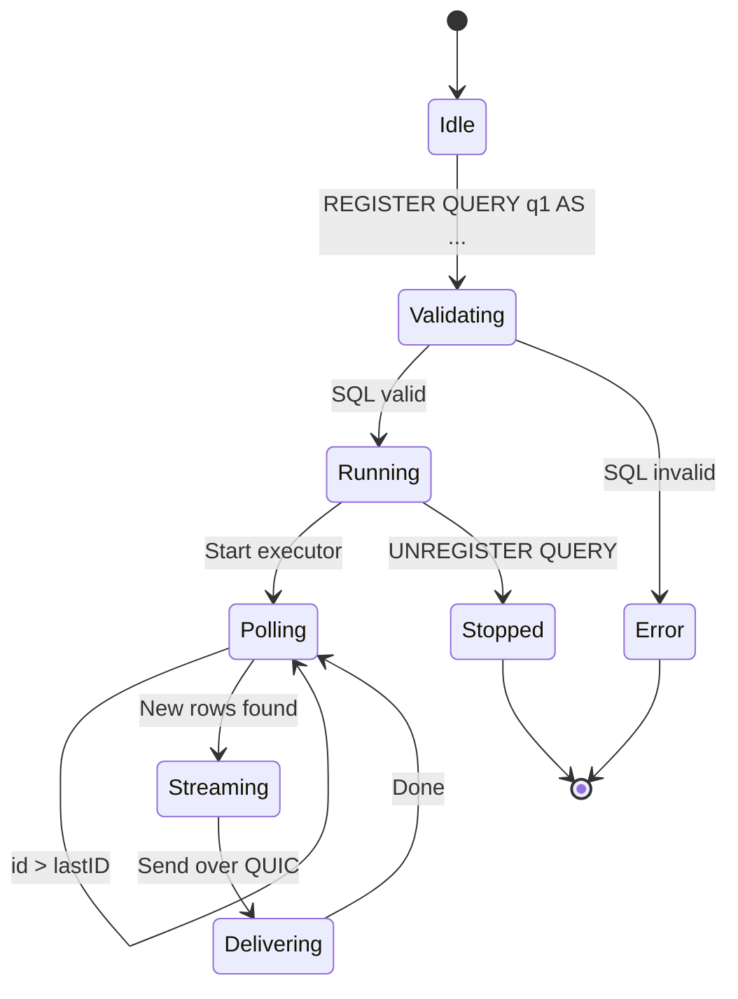

## Internal Components

### Query Manager

The query manager maintains the registry of active queries and coordinates their execution.

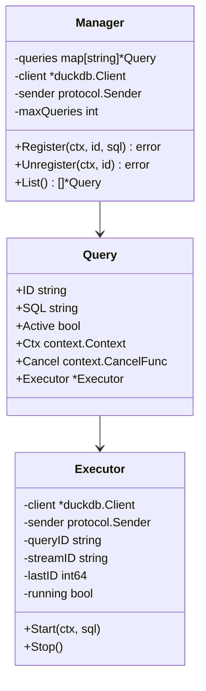

### QUIC Server

The QUIC server manages client connections and multiplexes query streams.

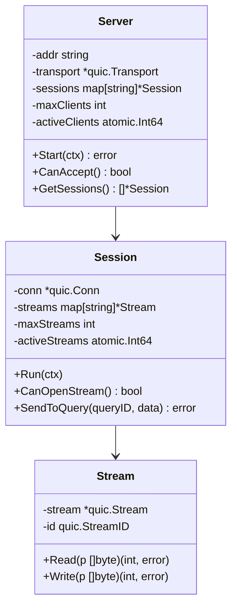

## Data Flow Details

### Event Ingestion

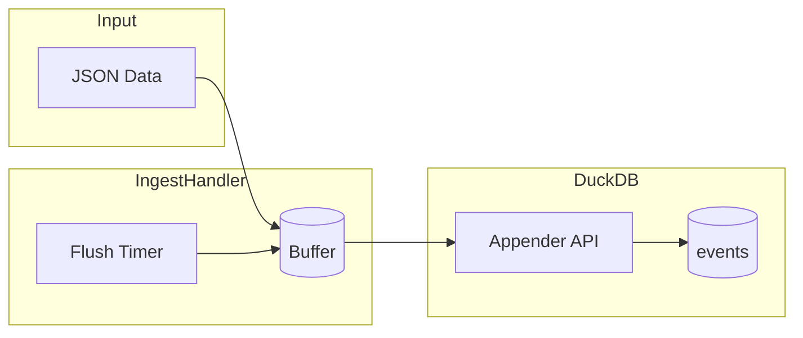

### Query Execution

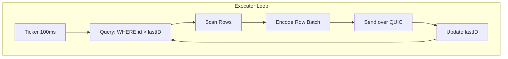

## Protocol

### Binary Message Format

```
[message_type: 1 byte][payload_length: 4 bytes][payload: n bytes]
```

| Type | Code | Description |
|------|------|-------------|
| Row Batch | 0x01 | JSON array of rows |
| Completed | 0x02 | Query finished |
| Error | 0x03 | Error message |
| Heartbeat | 0x04 | Keep-alive |

### Query Stream Mapping

Each registered query gets a dedicated QUIC stream:

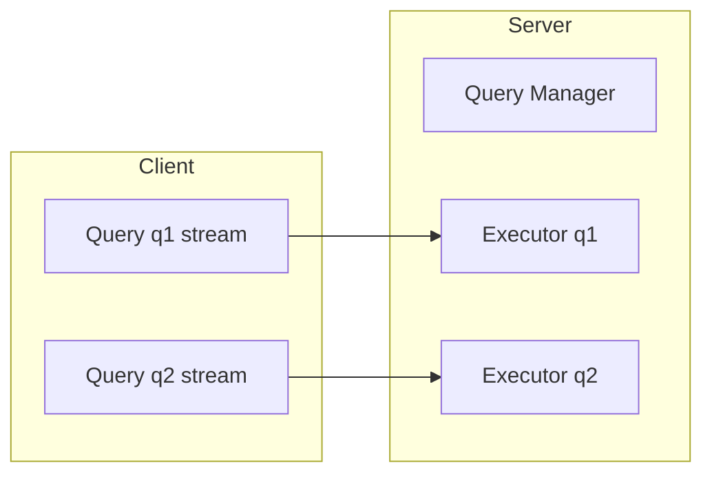

## Configuration

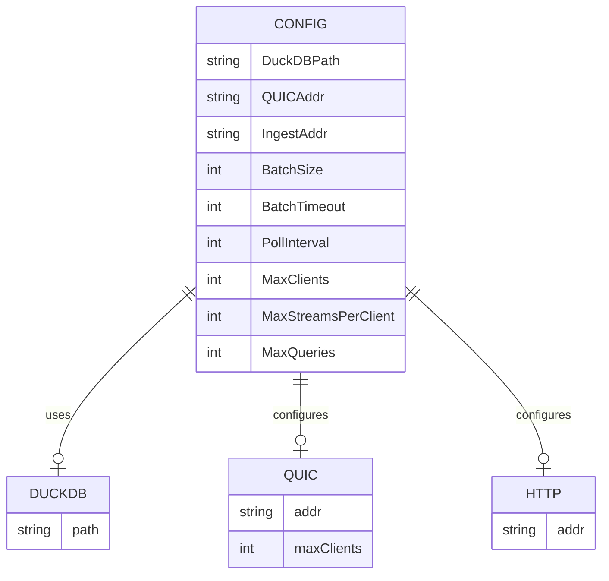

## Security & Limits

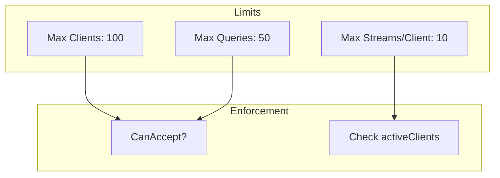

## Deployment

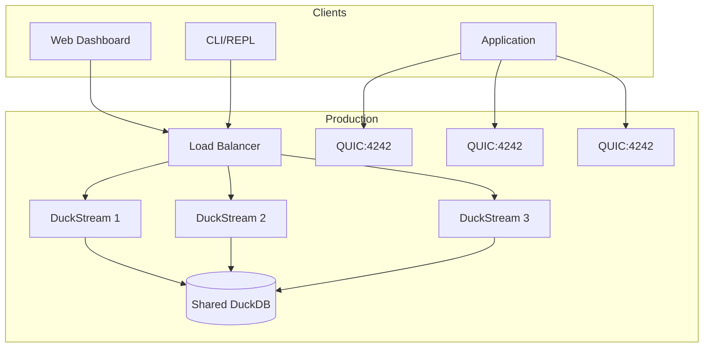

## Monitoring

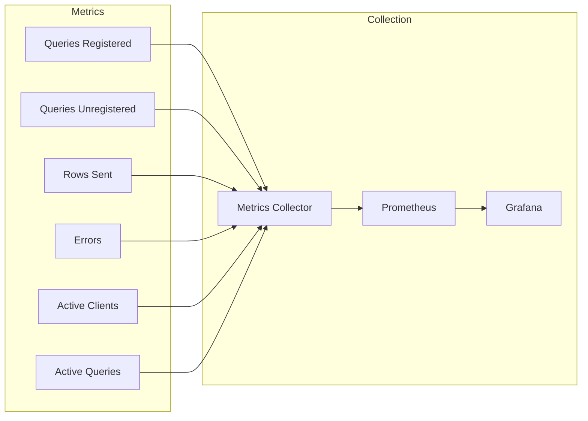