# DuckStream Architecture

## System Overview

DuckStream is a real-time streaming SQL engine built on DuckDB. It ingests events into a configurable `events` table by default at `/ingest`, and also supports table-specific ingestion on `/ingest/<table>`. Registered SQL queries can target any table that exposes a valid cursor column (e.g., `id` BIGINT or `created_at` TIMESTAMP), and are delivered as continuously running streams over QUIC.

## High-Level Architecture

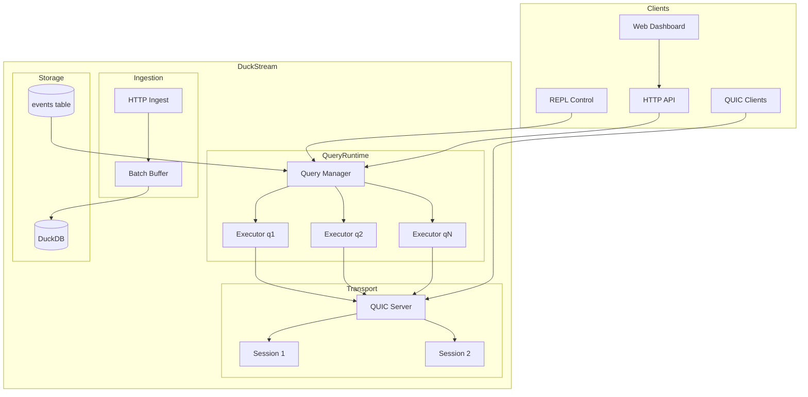

## Component Interactions

### Data Flow

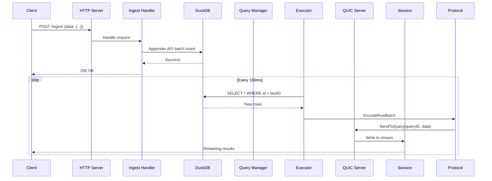

### Query Lifecycle

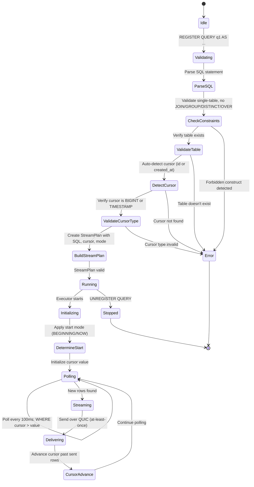

### Query Compilation (StreamPlan)

The **StreamPlan** is the compiled representation of a query, created during registration:

1. **SQL Parsing**: Extract table name, columns, WHERE clause from SELECT statement
2. **Constraint Validation**: Reject JOINs, GROUP BY, DISTINCT, window functions, subqueries
3. **Table Resolution**: Verify table exists in DuckDB and is accessible
4. **Cursor Detection**: Auto-detect monotonic cursor (`id` BIGINT → preferred, `created_at` TIMESTAMP → fallback)
5. **Cursor Validation**: Verify cursor column exists and is BIGINT or TIMESTAMP
6. **SQL Building**: Construct parameterized polling query `SELECT ... WHERE <cursor> > ?`
7. **Stream State Initialization**: Prepare cursor value based on start mode (BEGINNING/NOW)

### Query State and Metrics

- **StreamState** tracked per query in `Executor`:
  - `CursorValue` (`int64` for BIGINT or `time.Time` for TIMESTAMP)
  - `RowsSent` (streamed rows count)
  - `LastUpdateAt` (last emitted update timestamp)
  - `InitializedAt` (stream initialization moment)
- `Manager.GetAllQueryStates()` exposes active states.
- `/metrics` includes per-query block:
  - `id`, `last_cursor`, `rows_streamed`, `lag_ms` (computed for TIMESTAMP cursor)

### SQL Validation & Error Handling

DuckStream performs strict SQL validation at registration time to ensure queries can be safely and efficiently streamed. All validation errors are explicit and fail fast:

#### Validation Rules

**1. Single-Table SELECT Enforcement**

```
Error: "only single-table SELECT queries are supported"
Details: Query specifies multiple tables (detected by parsing FROM clause or JOIN keywords)
```

**2. JOIN Rejection**

```
Error: "JOINs are not supported in streaming queries"
Details: All join types (INNER, LEFT, RIGHT, FULL, CROSS) are forbidden
Reason: Streaming requires independent cursor tracking per table; joins break this property
```

**3. GROUP BY Rejection**

```
Error: "GROUP BY is not supported in streaming queries"
Details: Aggregation queries (COUNT, SUM, AVG, GROUP_CONCAT, etc.) after GROUP BY are forbidden
Reason: Aggregations re-compute entire results on each poll; no incremental semantics possible
```

**4. DISTINCT Rejection**

```
Error: "DISTINCT is not supported"
Details: DISTINCT keyword in SELECT clause is forbidden
Reason: Requires buffering all rows to eliminate duplicates; breaks streaming
```

**5. Window Function Rejection**

```
Error: "Window functions are not supported"
Details: OVER(...) window function syntax in SELECT expressions is forbidden
Reason: Complex per-row computations require buffering; incompatible with cursor-based streaming
```

**6. Subquery Rejection**

```
Error: "Subqueries are not supported"
Details: Nested SELECT queries in FROM, WHERE, or SELECT clauses are forbidden
Reason: Subqueries complicate cursor tracking and incremental execution
```

**7. Cursor Column Discovery**

```
Error: "no valid cursor column found (expected id or created_at)"
Details: After all other validations pass, DuckStream searches for a cursor column:
  - First: Look for `id` (BIGINT type required)
  - Second: Look for `created_at` (TIMESTAMP type required)
  - None found: Registration fails
```

**8. Cursor Type Validation**

```
Error: "cursor column must be BIGINT or TIMESTAMP"
Details: If cursor column found but wrong type (e.g., VARCHAR, INT, NUMERIC):
  - BIGINT: Supports auto-incrementing sequences and numeric IDs
  - TIMESTAMP: Supports monotonic insertion time tracking
  - Other types: Insufficient guarantees for incremental delivery
```

#### Online vs. Upfront Validation

- **Upfront Validation (Registration Time)**: All constraints above are checked when `REGISTER QUERY` is issued
- **Online Detection (Runtime)**: Per-query metrics and cursor state are tracked during execution
- **No Runtime SQL Errors**: If a query passes registration, it will never fail during polling (assuming data integrity)

## Internal Components

### Query Manager

The query manager maintains the registry of active queries and coordinates their execution.

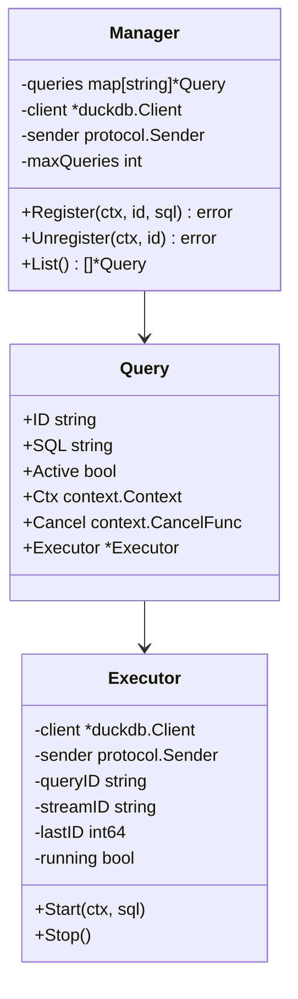

### QUIC Server

The QUIC server manages client connections and multiplexes query streams.

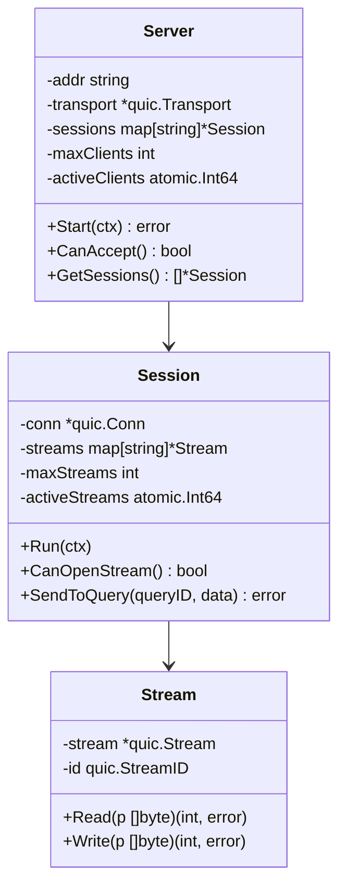

## Data Flow Details

### Event Ingestion

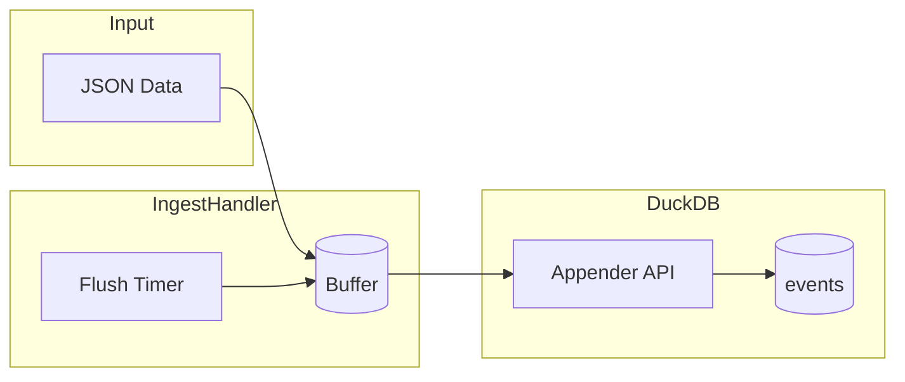

### Query Execution

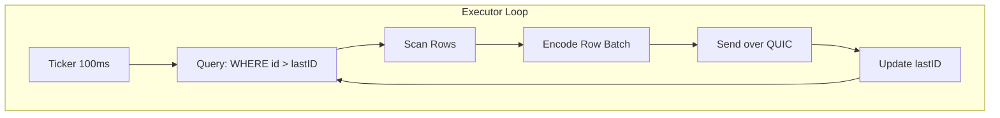

## Protocol

### Binary Message Format

```
[message_type: 1 byte][payload_length: 4 bytes][payload: n bytes]
```

| Type | Code | Description |
|------|------|-------------|
| Row Batch | 0x01 | JSON array of rows |
| Completed | 0x02 | Query finished |
| Error | 0x03 | Error message |
| Heartbeat | 0x04 | Keep-alive |

### Query Stream Mapping

Each registered query gets a dedicated QUIC stream:

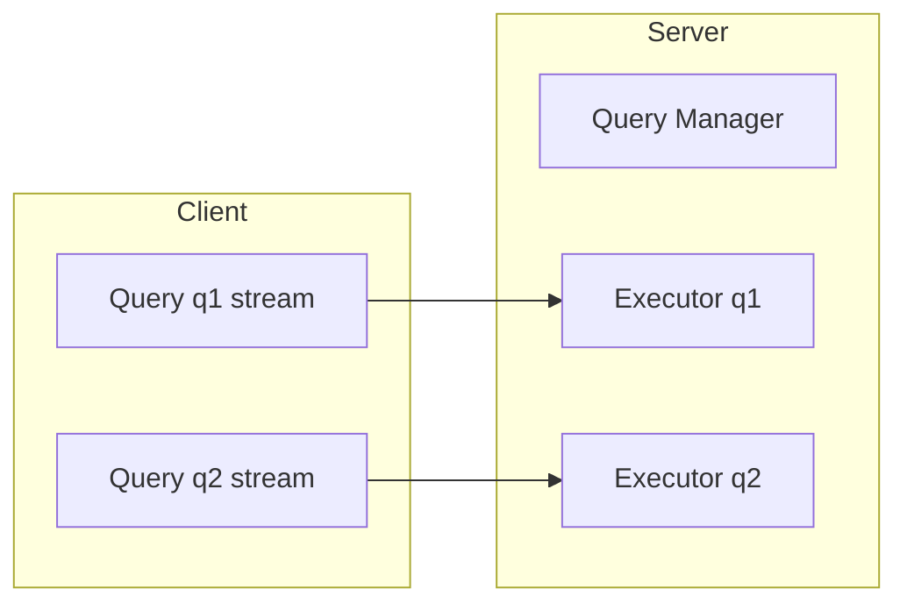

## Configuration

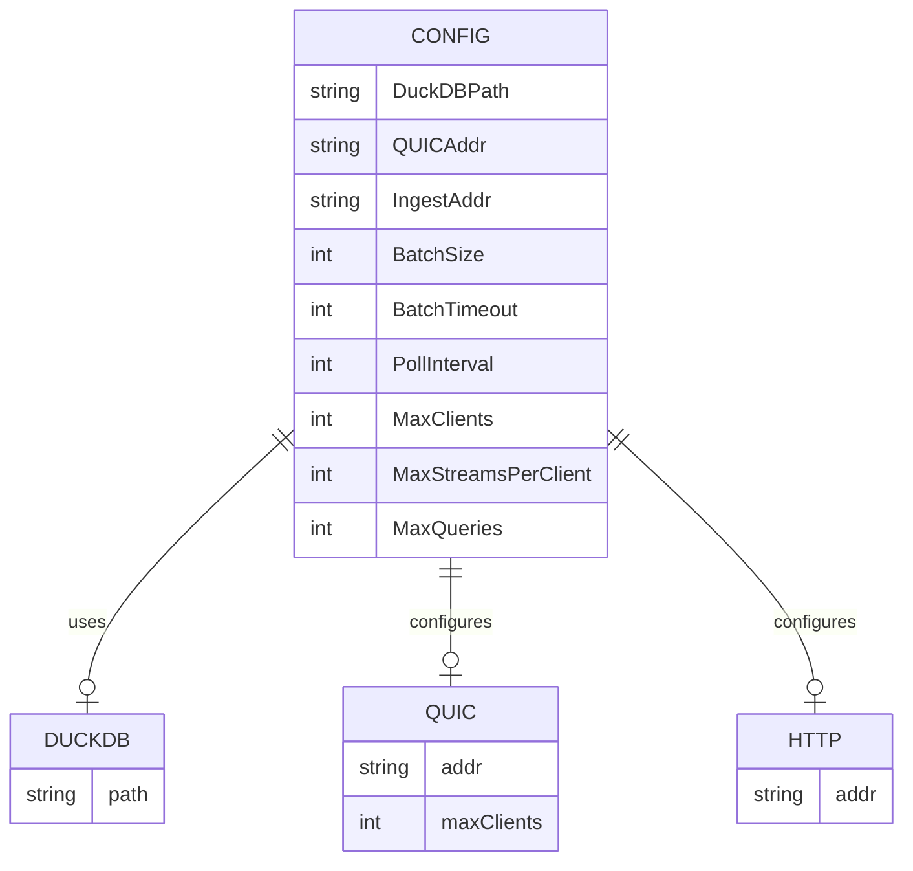

## Security & Limits

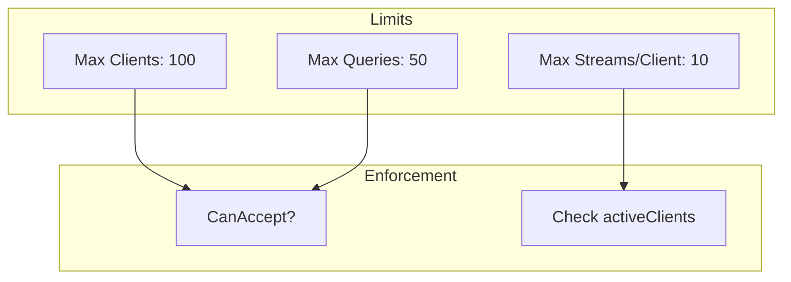

## Deployment

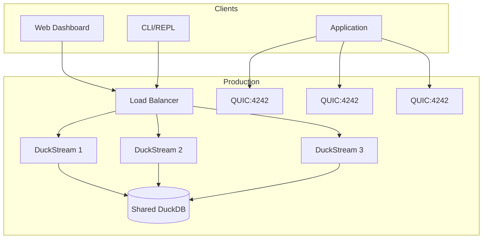

## Monitoring

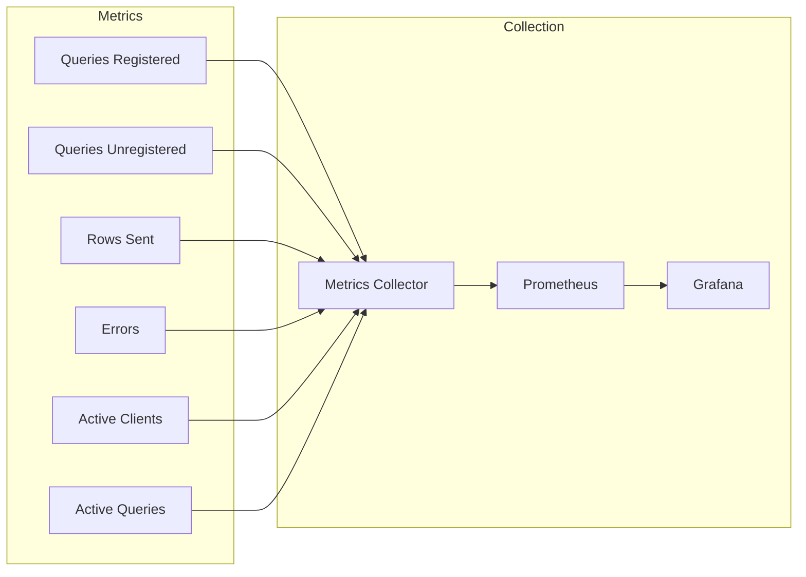